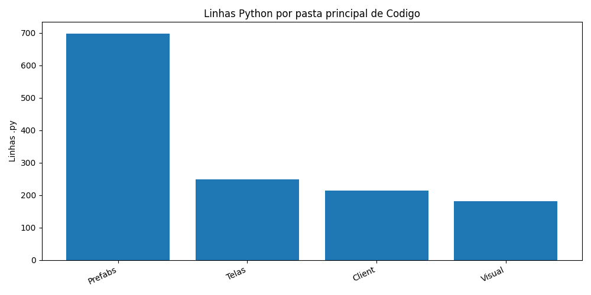
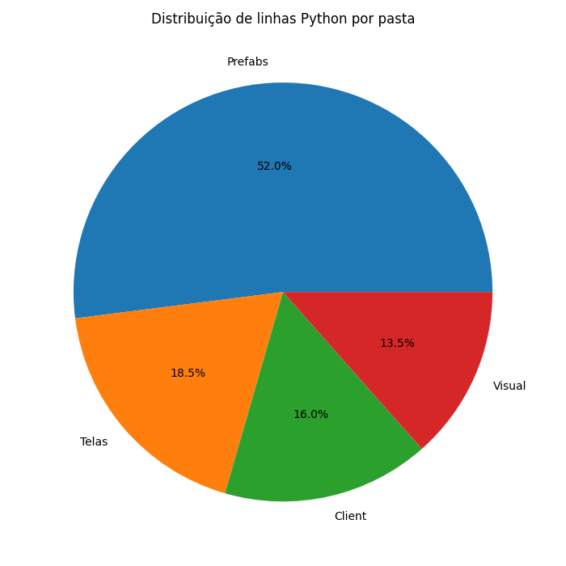
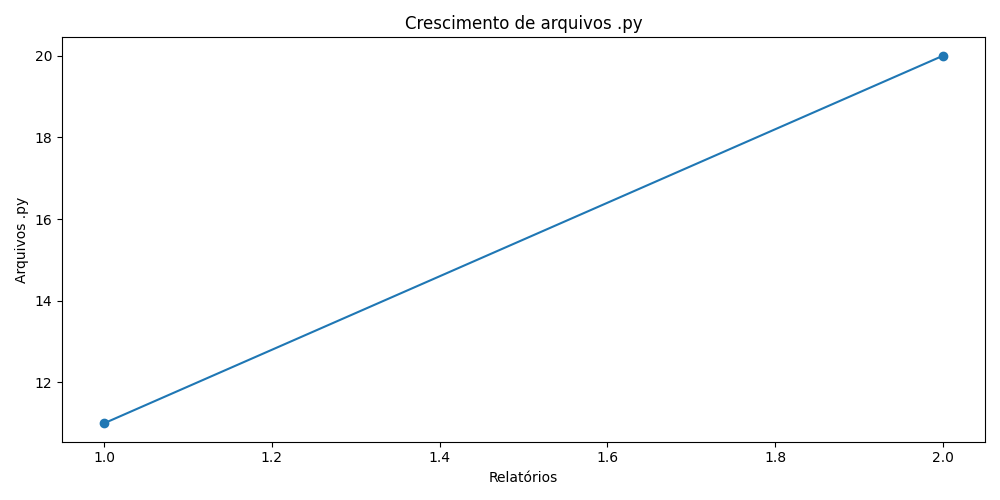
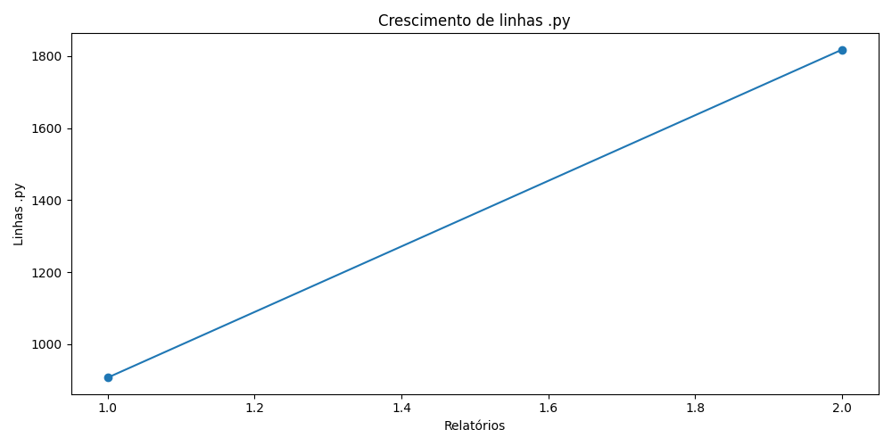
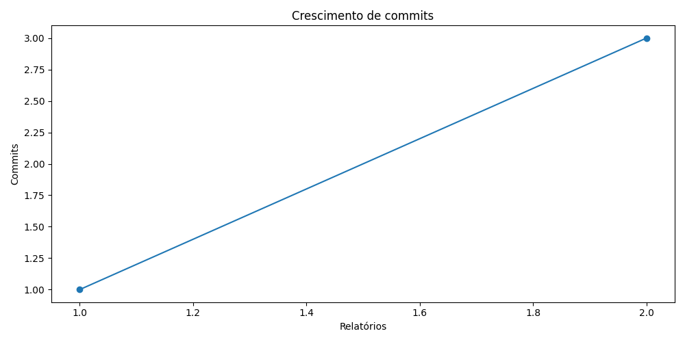

# Registro do War Multiversal

**Data:** 2026-06-16T11:12:55
**Autor:** Leon Soto

## Resumo geral

- Tamanho: 7.38 MB
- Arquivos no geral: 30
- Número de commits: 3
- Dias desde a criação do repo: 0

## Python

- Linhas .py: 1818
- Arquivos .py: 20
- Classes .py: 18
- Métodos e funções .py: 150
- Métodos .py: 129
- Funções soltas .py: 21

## Top 10 maiores arquivos .py

1. `Ferramentas/GeradorRelatorios.py` — 354 linhas
2. `Codigo/Prefabs/Botao.py` — 265 linhas
3. `Codigo/Client/ControladorJogo.py` — 153 linhas
4. `Codigo/Telas/Telas/TelaConfiguracoes.py` — 135 linhas
5. `Codigo/Prefabs/Slider.py` — 125 linhas
6. `Codigo/Telas/Telas/TelaInicial.py` — 114 linhas
7. `Codigo/Visual/PipelineGrafica.py` — 90 linhas
8. `Codigo/Prefabs/Mensagem.py` — 66 linhas
9. `Game.py` — 64 linhas
10. `Codigo/Client/Sonoridades.py` — 62 linhas

## Rank das pastas principais de Codigo

1. `Prefabs` — 699 linhas .py, 10 arquivos
2. `Telas` — 249 linhas .py, 2 arquivos
3. `Client` — 215 linhas .py, 2 arquivos
4. `Visual` — 181 linhas .py, 3 arquivos

## Gráficos

### Barras das pastas principais

### Pizza das pastas principais

### Crescimento de arquivos Python

### Crescimento de linhas Python

### Crescimento de commits

