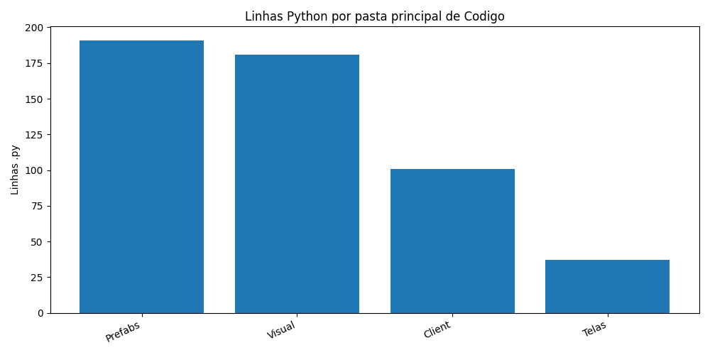
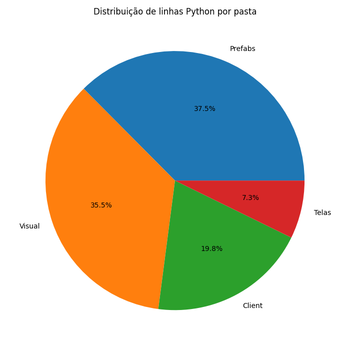
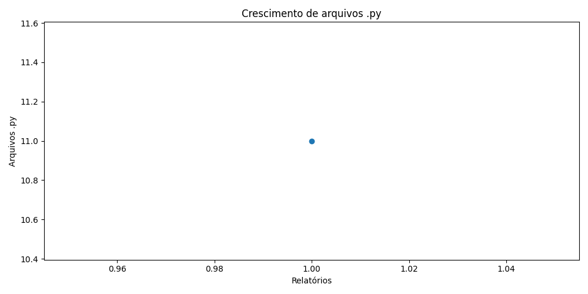
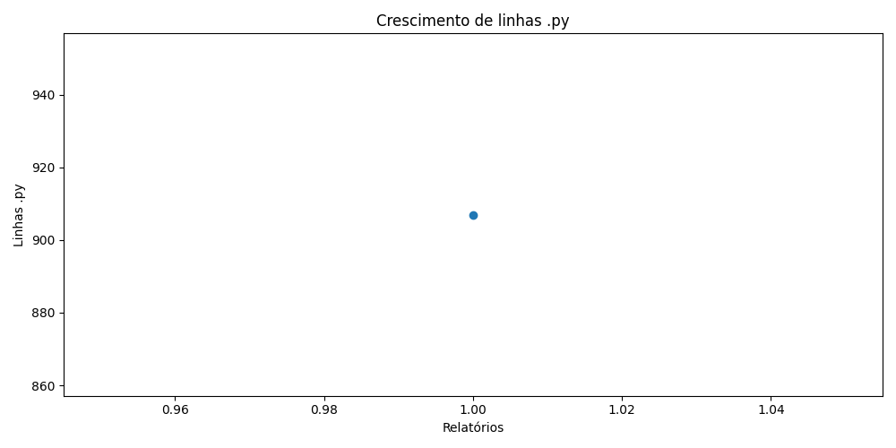
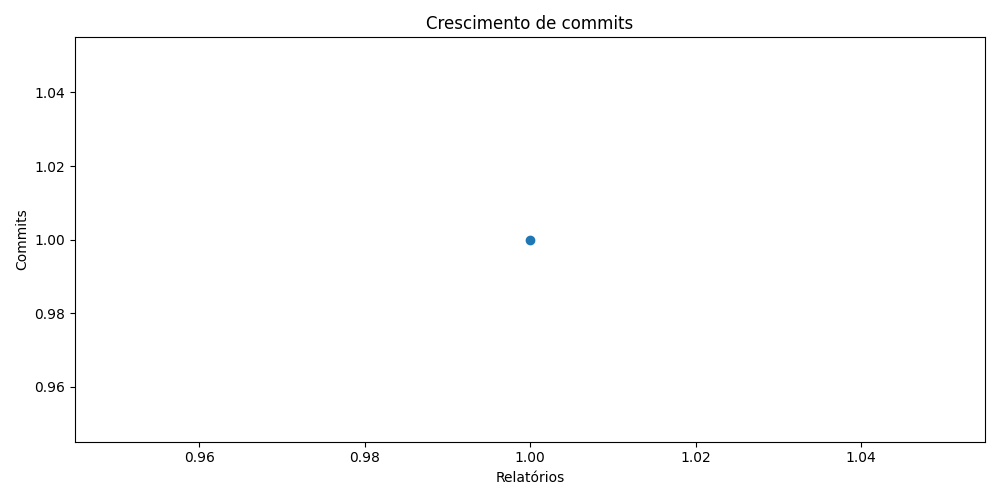

# Registro do War Multiversal

**Data:** 2026-06-12T01:21:10
**Autor:** Leon Soto

## Resumo geral

- Tamanho: 29.00 KB
- Arquivos no geral: 12
- Número de commits: 1
- Dias desde a criação do repo: 0

## Python

- Linhas .py: 907
- Arquivos .py: 11
- Classes .py: 9
- Métodos e funções .py: 69
- Métodos .py: 53
- Funções soltas .py: 16

## Top 10 maiores arquivos .py

1. `Ferramentas/GeradorRelatorios.py` — 330 linhas
2. `Codigo/Client/ControladorJogo.py` — 101 linhas
3. `Codigo/Visual/PipelineGrafica.py` — 90 linhas
4. `Codigo/Prefabs/Botao.py` — 71 linhas
5. `Game.py` — 67 linhas
6. `Codigo/Visual/TransicaoTela.py` — 58 linhas
7. `Codigo/Prefabs/Texto.py` — 51 linhas
8. `Codigo/Prefabs/Subtela.py` — 45 linhas
9. `Codigo/Telas/Telas/TelaInicial.py` — 37 linhas
10. `Codigo/Visual/LayoutResponsivo.py` — 33 linhas

## Rank das pastas principais de Codigo

1. `Prefabs` — 191 linhas .py, 4 arquivos
2. `Visual` — 181 linhas .py, 3 arquivos
3. `Client` — 101 linhas .py, 1 arquivos
4. `Telas` — 37 linhas .py, 1 arquivos

## Gráficos

### Barras das pastas principais

### Pizza das pastas principais

### Crescimento de arquivos Python

### Crescimento de linhas Python

### Crescimento de commits

